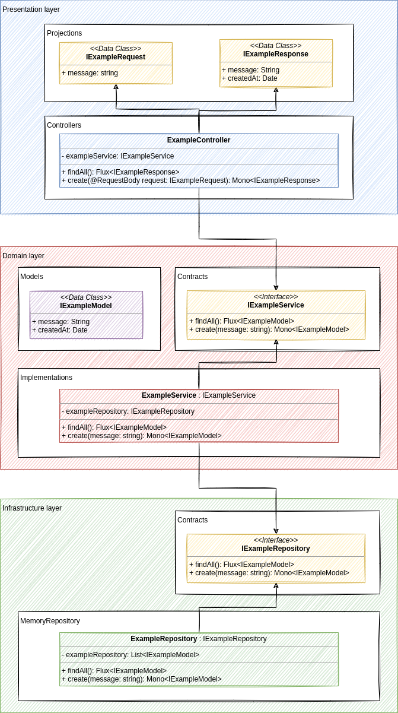

# 🥽 Inspection service

Updated at 16/07/2021. Project created with draw.io and available at `./docs/diagram.project.drawio`.

# 🔖 Documentation:

## About our architecture

- **Presentation layer:** provides the access to our services for our final user through HTTP requests
  - **Projections:** provides the interfaces for our services' requests and responses 
  - **Controllers:** responsible for taking the HTTP request and delegating the call to the handlers
  - **Handlers:** responsible for delegating the call to the Services and, most importantly, adapt the result from the service to an adequate public representation of the model
- **Domain layer:** the domain layer contains our business model, rules and methods
  - **Models:** provides our entities through classes 
  - **Errors:** contains our module's exceptions custom classes
  - **Contracts:** contains the interfaces for our services, responsible for abstracting the communication between the presentation and domain layer through dependency injection 
  - **Implementations:** contains the implementations of our application services, being called by our handlers, implementing our contracts and communicating with the infrastructure layer
- **Infrastructure layer:** Here we're going to have multiple packages, each one responsible for implementing a specific contract needed by a domain service (as a repository from the persistence layer, for example)
  - **Contracts:** contains the interfaces for our dependencies, responsible for abstracting the communication between the domain and infrastructure layer through dependency injection
  - *Each contract implementation is going to be a new folder/package inside the infrastructure layer* 

## Managing dependency injection

Spring has some decorators/annotations that are used by SPRING to detect and automatically manage dependency injection.

- `@RestController`: A controller responsible for the REST communication.
- `@Component`: It is the base for others annotations. Component marks the beans as Spring's managed components.
- `@Service`: Service is a meta-annotation of Component. It indicates that it is holding the business logic.
- `@Repository`: Repository is a meta-annotation of Component. It represents the database access layer in an application.

Some references:

- https://docs.spring.io/spring-boot/docs/current/reference/html/using.html#using.spring-beans-and-dependency-injection
- https://www.baeldung.com/spring-component-repository-service

## Read more

- [Environment setup](docs/environment-setup.md)
- [Project initial setup](docs/project-setup.md)
- [Development process](docs/development-process.md)
- [Libraries licenses](docs/libraries.md)

# 👨🏻‍💻 Commands list:

- Show all tasks: `./gradlew tasks`
- Check code format: `./gradlew ktlintCheck`
- Format code: `./gradlew ktlintFormat`
- Run project for development: `./gradlew bootRun`
- Run automated tests: `./gradlew test`
- Generate code documentation: `./gradlew dokkaHtml`
- Show endpoints documentation (project must be running): Access `http://localhost:8080/swagger-ui.html`