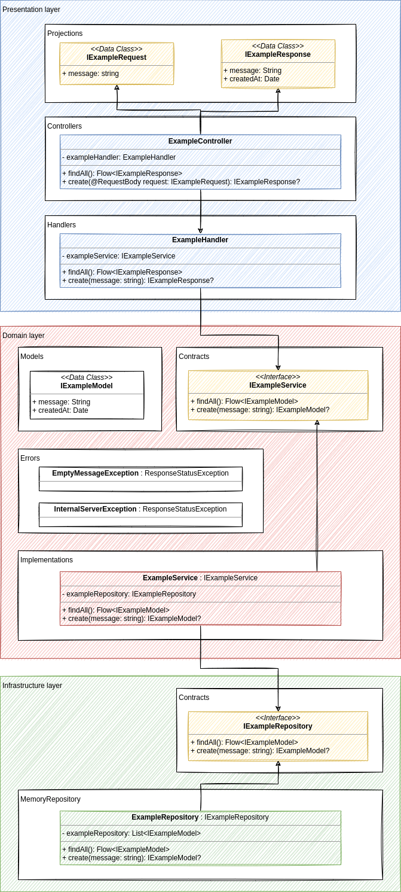

# 🥽 Kotlin + Springboot + Hexagonal Arch 

Atualizado em 16/07/2021. Projeto criado na ferramenta draw.io e disponibilizado em `./docs/diagram/project.drawio`.

# 🔖 Documentações:

- [Configuração de ambiente](docs/environment-setup.md)
- [Configuração inicial do projeto](docs/project-setup.md)
- [Processo de desenvolvimento](docs/development-process.md)

# 👨🏻‍💻 Lista de comandos:

- Help: `./gradlew tasks`
- Check if code is correctly formatted: `./gradlew ktlintCheck`
- Format code: `./gradlew ktlintFormat`
- Run for development: `./gradlew bootRun`
- Run unit tests: `./gradlew test`
- Generating docs file: `./gradlew dokkaHtml`